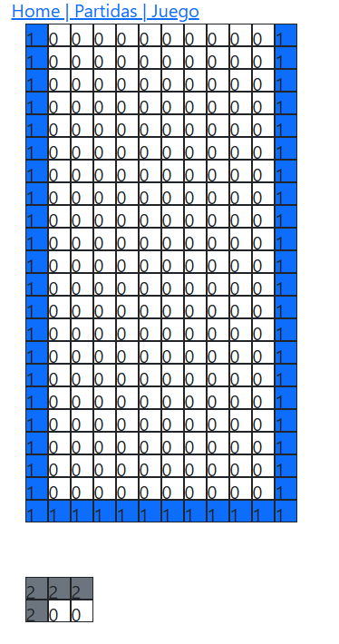
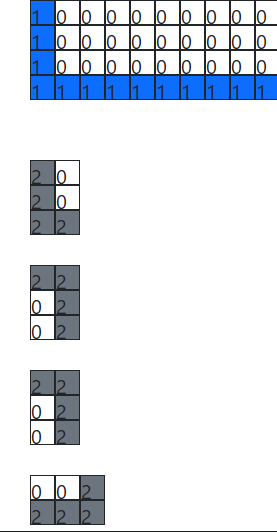
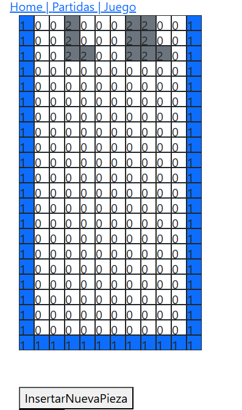

# Proyecto Tetris: Especificaciones

## Índice

- [Proyecto Tetris: Especificaciones](#proyecto-tetris-especificaciones)
  - [Índice](#índice)
  - [Introducción](#introducción)
    - [Conceptos y Tecnologías a Practicar](#conceptos-y-tecnologías-a-practicar)
  - [Objetivo del Proyecto](#objetivo-del-proyecto)
  - [Historias de Usuario](#historias-de-usuario)
    - [Historia de Usuario 1: Configuración Inicial del Proyecto 🛠️](#historia-de-usuario-1-configuración-inicial-del-proyecto-️)
      - [Criterios de Aceptación ✅](#criterios-de-aceptación-)
      - [Tareas 📌](#tareas-)
      - [Control de Versiones 🗂️](#control-de-versiones-️)
    - [Historia de Usuario 2: Implementación de la Vista Partidas 📋](#historia-de-usuario-2-implementación-de-la-vista-partidas-)
      - [Criterios de Aceptación ✅](#criterios-de-aceptación--1)
      - [Tareas 📌](#tareas--1)
      - [Control de Versiones 🗂️](#control-de-versiones-️-1)
    - [Historia de Usuario 3: Creación de las Vistas del Juego 🖥️](#historia-de-usuario-3-creación-de-las-vistas-del-juego-️)
      - [Criterios de Aceptación ✅](#criterios-de-aceptación--2)
      - [Tareas 📌](#tareas--2)
      - [Control de Versiones 🗂️](#control-de-versiones-️-2)
    - [Historia de Usuario 4: Creación de la Estructura Básica del Juego 🎮](#historia-de-usuario-4-creación-de-la-estructura-básica-del-juego-)
      - [Criterios de Aceptación ✅](#criterios-de-aceptación--3)
      - [Tareas 📌](#tareas--3)
        - [**Tarea 1**:](#tarea-1)
        - [**Tarea 2**: Componente `panel.jsx`](#tarea-2-componente-paneljsx)
        - [**Tarea 5**: Componente `pieza.jsx`](#tarea-5-componente-piezajsx)
        - [**Tarea 6**: Función `colorPieza()`](#tarea-6-función-colorpieza)
        - [**Tarea 7**: Clase `modeloPieza`](#tarea-7-clase-modelopieza)
        - [**Tarea 8**: Función `nuevaPieza()`](#tarea-8-función-nuevapieza)
        - [**Tarea 9:**: Función `InsertaNuevaPieza()`](#tarea-9-función-insertanuevapieza)
      - [Control de Versiones 🗂️](#control-de-versiones-️-3)
    - [Historia de Usuario 5: Control de Movimientos e Inicio del Juego 🎯](#historia-de-usuario-5-control-de-movimientos-e-inicio-del-juego-)
      - [Criterios de Aceptación ✅](#criterios-de-aceptación--4)
      - [Tareas 📌](#tareas--4)
      - [Control de Versiones 🗂️](#control-de-versiones-️-4)
    - [Historia de Usuario 6: Puntuación, Guardado de Partida y Vista Ranking 🏆](#historia-de-usuario-6-puntuación-guardado-de-partida-y-vista-ranking-)
      - [Criterios de Aceptación ✅](#criterios-de-aceptación--5)
      - [Tareas 📌](#tareas--5)
      - [Control de Versiones 🗂️](#control-de-versiones-️-5)
    - [Historia de Usuario 7: Funcionalidades Avanzadas ✨](#historia-de-usuario-7-funcionalidades-avanzadas-)
      - [Criterios de Aceptación ✅](#criterios-de-aceptación--6)
      - [Control de Versiones 🗂️](#control-de-versiones-️-6)


---

## Introducción

El **Proyecto Tetris** es una iniciativa educativa diseñada para estudiantes del grado superior de Desarrollo de Aplicaciones Web que están comenzando con React. A lo largo de este proyecto, los estudiantes tendrán la oportunidad de poner en práctica una amplia gama de conceptos y tecnologías que abarcan desde la programación hasta el despliegue de una aplicación web completa.

### Conceptos y Tecnologías a Practicar

- **React y Vite**: Creación de aplicaciones web modernas utilizando React como biblioteca principal y Vite como herramienta de construcción para un desarrollo rápido y eficiente.
- **Componentes y Estado en React**: Diseño de componentes reutilizables y gestión del estado interno y global de la aplicación.
- **Gestión de Rutas con React Router**: Implementación de navegación entre diferentes vistas y componentes.
- **JavaScript ES6+**: Uso de características modernas de JavaScript, incluyendo clases, módulos, y funciones flecha.
- **Programación Orientada a Objetos (POO)**: Creación de clases y objetos para modelar las piezas y lógica del juego Tetris.
- **Manipulación de Arrays y Matrices**: Gestión de estructuras de datos complejas para representar el tablero y las piezas del juego.
- **Eventos y Control de Teclado**: Captura y manejo de eventos de teclado para controlar el movimiento de las piezas.
- **Estilos y Diseño con Bootstrap**: Aplicación de estilos y diseño responsivo utilizando Bootstrap como framework CSS.
- **Control de Versiones con Git y GitHub**: Uso de Git para el control de versiones, creación de ramas, commits y pull requests. Colaboración en equipo a través de GitHub.
- **Calidad de Código con ESLint**: Configuración y uso de ESLint con la guía de estilo Standard para mantener un código limpio y consistente.
- **Despliegue Continuo con Vercel**: Configuración de despliegues automáticos para publicar la aplicación en Vercel después de cada commit en la rama principal.
- **Metodología Ágil y Planificación**: Organización del proyecto en sprints, gestión de historias de usuario y tareas, y seguimiento del progreso.
- **Pruebas y Depuración**: Identificación y corrección de errores, y mejora continua del código.
- **Buenas Prácticas de Desarrollo**: Uso de patrones de diseño, documentación clara y trabajo en equipo.

Este proyecto no solo busca que los estudiantes desarrollen una aplicación funcional, sino también que adquieran habilidades esenciales para su futuro profesional en el desarrollo web.

---

## Objetivo del Proyecto

- Desarrollar el juego del Tetris.
- Inicialmente, se mostrará una pantalla con las instrucciones del juego.
- Al hacer clic en el botón de **JUGAR**, se cargará la pantalla del juego con la información de la partida. Las piezas comenzarán a aparecer de manera aleatoria y en posiciones aleatorias, y empezarán a descender.
- Las teclas de flecha derecha e izquierda permitirán mover las piezas, mientras que la flecha abajo servirá para girarlas.
- El panel de la izquierda mostrará la información de la partida.
- El panel de la derecha mostrará las piezas que aparecerán después.
- Con la tecla **X**, se podrá guardar la pieza actual o intercambiarla con la pieza guardada.
- Cuando las piezas formen una fila completa, esta fila se borrará y los puntos se incrementarán.
- Cada movimiento de la pieza hacia abajo incrementará los puntos. Al llegar a 10,000 puntos, se borrarán las piezas del panel y se incrementará un nivel, comenzando de nuevo la partida.
- Cuando el panel esté lleno de piezas, la partida terminará.
- Al finalizar la partida, se dará la opción de guardar los datos del jugador y se mostrará la lista de partidas y el ranking de los mejores jugadores.

---

## Historias de Usuario

### Historia de Usuario 1: Configuración Inicial del Proyecto 🛠️

> _Como desarrollador, quiero crear una aplicación con React utilizando Vite, Bootstrap, configurar el linter ESLint con Standard, GitHub y desplegarla en Vercel, para establecer una base sólida para el desarrollo del proyecto._

#### Criterios de Aceptación ✅

- Crear una nueva aplicación React utilizando Vite.
- Integrar Bootstrap para el diseño y estilo de la interfaz de usuario.
- Configurar ESLint utilizando la guía de estilo Standard para garantizar un código coherente y de calidad.
- Crear un repositorio en GitHub para versionar el código.
- Configurar el despliegue automático en Vercel después de cada commit en la rama principal del repositorio.

#### Tareas 📌

- **Tarea 1**: Instalar Node.js y configurar el entorno de desarrollo.
- **Tarea 2**: Crear una nueva aplicación React con Vite.
- **Tarea 3**: Integrar Bootstrap en el proyecto.
- **Tarea 4**: Configurar ESLint con la guía de estilo Standard.
- **Tarea 5**: Crear un repositorio en GitHub y subir el proyecto inicial.
- **Tarea 6**: Configurar Vercel para el despliegue continuo.

#### Control de Versiones 🗂️

- **Rama Git**: `historia-usuario-1-configuracion-inicial`
- **Commits**:
  - _Tarea 1_: `Configura entorno de desarrollo con Node.js`
  - _Tarea 2_: `Crea aplicación React con Vite`
  - _Tarea 3_: `Integra Bootstrap en el proyecto`
  - _Tarea 4_: `Configura ESLint con Standard`
  - _Tarea 5_: `Inicia repositorio GitHub y sube el proyecto`
  - _Tarea 6_: `Configura despliegue continuo en Vercel`
- **Pull Request**: Al finalizar la historia, crear un pull request para fusionar `historia-usuario-1-configuracion-inicial` con `main`.

---

### Historia de Usuario 2: Implementación de la Vista Partidas 📋

> _Como desarrollador, quiero crear la vista **Partidas** que muestre una tabla con las partidas jugadas, y que permita ordenar la tabla según las columnas, para facilitar la visualización de los datos de las partidas._

#### Criterios de Aceptación ✅

- La vista **Partidas** debe mostrar una tabla con los datos de las partidas a partir de un array.
- Cada columna de la tabla debe tener un botón que permita ordenar los datos según la columna correspondiente (nick, puntos, fecha).
- Añadir un botón fuera de la tabla que permita **agregar datos de una nueva partida** mediante una ventana modal con un formulario para introducir el nick. Al hacer clic en **aceptar**, la partida se introducirá en el array y se reflejará en la tabla.

#### Tareas 📌

- **Tarea 1**: Crear el componente de la tabla de partidas.
- **Tarea 2**: Definir el array `partidas` con datos de prueba.
- **Tarea 3**: Implementar la funcionalidad de ordenación por columnas.
- **Tarea 4**: Añadir el botón para agregar una nueva partida y crear la ventana modal.
- **Tarea 5**: Actualizar el array `partidas` con los nuevos datos y re-renderizar la tabla.

#### Control de Versiones 🗂️

- **Rama Git**: `historia-usuario-2-vista-partidas`
- **Commits**:
  - _Tarea 1_: `Crea componente de tabla para partidas`
  - _Tarea 2_: `Define array de partidas con datos de prueba`
  - _Tarea 3_: `Implementa ordenación por columnas en la tabla`
  - _Tarea 4_: `Añade botón y modal para agregar nuevas partidas`
  - _Tarea 5_: `Actualiza array de partidas con nuevas entradas`
- **Pull Request**: Al finalizar la historia, crear un pull request para fusionar `historia-usuario-2-vista-partidas` con `main`.

---

### Historia de Usuario 3: Creación de las Vistas del Juego 🖥️

> _Como desarrollador, quiero crear diversas vistas para la aplicación (Inicio, Juego, Partidas, Ranking) y utilizar React Router para gestionar la navegación, para proporcionar una interfaz clara y fácil de navegar para los usuarios._

#### Criterios de Aceptación ✅

- Crear la vista **Inicio** que contiene las instrucciones del juego.
- Crear la vista **Juego** que muestra el panel de las piezas en movimiento y la información de la partida.
- Crear la vista **Partidas** que muestra una lista de todas las partidas jugadas.
- Crear la vista **Ranking** que muestra el ranking de los jugadores con más puntos.
- Utilizar React Router para gestionar la navegación entre estas vistas.

#### Tareas 📌

- **Tarea 1**: Instalar React Router en el proyecto.
- **Tarea 2**: Crear el componente para la vista **Inicio** con las instrucciones.
- **Tarea 3**: Crear el componente para la vista **Juego**.
- **Tarea 4**: Reutilizar el componente de la tabla para la vista **Partidas**.
- **Tarea 5**: Crear el componente para la vista **Ranking**.
- **Tarea 6**: Configurar las rutas con React Router.
- **Tarea 7**: Añadir un menú de navegación para acceder a las diferentes vistas.

#### Control de Versiones 🗂️

- **Rama Git**: `historia-usuario-3-vistas-juego`
- **Commits**:
  - _Tarea 1_: `Instala React Router`
  - _Tarea 2_: `Crea componente para la vista Inicio`
  - _Tarea 3_: `Crea componente para la vista Juego`
  - _Tarea 4_: `Reutiliza componente de tabla para Partidas`
  - _Tarea 5_: `Crea componente para la vista Ranking`
  - _Tarea 6_: `Configura rutas con React Router`
  - _Tarea 7_: `Añade menú de navegación`
- **Pull Request**: Al finalizar la historia, crear un pull request para fusionar `historia-usuario-3-vistas-juego` con `main`.

---

### Historia de Usuario 4: Creación de la Estructura Básica del Juego 🎮

> _Como desarrollador, quiero crear la estructura básica del juego utilizando objetos y clases para garantizar una arquitectura clara y escalable, para facilitar el desarrollo y el mantenimiento del proyecto._

#### Criterios de Aceptación ✅

- **modelos.js**: Crear y exportar un objeto `modelos` con todos los modelos de piezas y sus variantes de posición y de la matriz principal.
- **Clase ModeloPieza()**: Crear la clase para las piezas del juego.

#### Tareas 📌

##### **Tarea 1**: 
Crea una carpeta `lib` para almacenar funciones, clases, etc.
Crea, en `lib` ,  un archivo `modelos.js`. Define y exporta el objeto `modelos` con las piezas del Tetris y la matriz principal.

```javascript

modelos = {
  matriz: [
    [1,0,0,0,0,0,0,0,0,0,0,1],
    [1,0,0,0,0,0,0,0,0,0,0,1],
    ...
    [1,1,1,1,1,1,1,1,1,1,1,1]
  ],
  piezas: [

    {
      nombre: "Ele",
      matriz: [
      [
        [2, 0],
        [2, 0],
        [2, 2],
      ],
      [
        [2, 2, 2],
        [2, 0, 0],
      ],
      [
        [2, 2],
        [0, 2],
        [0, 2],
      ],
      [
        [0, 0, 2],
        [2, 2, 2],
      ],
    },
    {},
    {}
    ...
    ]
}
```

##### **Tarea 2**: Componente `panel.jsx`
- Enla carpeta `componentes` crea y exporta el componente `panel.jsx`. Este componente recibe como prop un array de dos dimensiones de 22 filas y 12 columnas y renderiza el panel principal.

- Crea, en la vista juego, un estado `arrayCasillas` e inicialízalo con un array multidimensional corresondiente a la matriz principal que tienes en modelos.

- Inserta el componente `panel` y utiliza como prop el estado.

##### **Tarea 5**: Componente `pieza.jsx`
- Crea un componente `pieza.jsx` clonando el componente panel. Este lo utilizaremos para mostrar las piezas del modelo. 
- Insértalo en la vista del juego utilizando como prop las diferentes matrices de cada pieza y sus variantes de posición. Comprueba que todas las piezas se muestran correctamente.

##### **Tarea 6**: Función `colorPieza()`
- Crea en la carpeta `lib` una función que recibe un número (0,1,2,3,...)
y devuelve un texto correspondiente a los diferentes colores de fondo de bootstrap "bg-white", "bg-black", "bg-primary", "bg-secondary", etc.

- Utiliza esta función en los componentes `panel` y `pieza` para mostrar las piezas en diferentes colores.
  




##### **Tarea 7**: Clase `modeloPieza`
- Crea, en lib, la clase `modeloPieza`. Esta clase esta formada por:
  - propiedades: numero, nombre, angulo, matriz. (Todas propiedades públicas).
    - La propiedad numero contiene el numero de la pieza
    - La propiedad nombre guarda el nombre de la pieza, 
    - La propiedad angulo será un número (0,1,2,3) correspondiente a los ángulos 0º, 90º, 180º,270º.
    - La propiedad matriz tendrá asignada la matriz de `modelos`correspondiente al número de pieza y su posición.
  - método girar()
    - Este método permite incrementar angulo de uno en uno (de 90º en 90º) controlando que el valor solo tenga los valores 0,1,2 y 3.

##### **Tarea 8**: Función `nuevaPieza()`
- Crea la función `nuevaPieza` la cual devuelve una instancia de la clase pieza donde el número de la pieza será aleatorios y el ángulo será 0.
- Inserta varios componentes `pieza`donde la matriz que reciban como prop corresponda a la matriz de diferentes instancias creadas a través de la función nuevaPieza. Comprueba que son piezas aleatorias en posiciones aleatorias.
  


##### **Tarea 9:**: Función `InsertaNuevaPieza()`
- Crea un estado `piezaActual` e inicializalo con una instancia obtenida de la función nuevaPieza().
- Crea una función capaz de insertar en una columna aleatoria (la fila será siempre 0) del panel la matriz de la nueva pieza instanciada
- Crea un botón para probar la función. Al hacer click llamara a la función apareciendo la nueva pieza en el panel.

 
  
#### Control de Versiones 🗂️
Rama: historia-usuario-4-estructura-basica
Commits: Un commit por tarea.
Pull Request al finalizar la historia.


---

### Historia de Usuario 5: Control de Movimientos e Inicio del Juego 🎯

> _Como desarrollador, quiero implementar el control de las teclas y los movimientos de las piezas, así como el mecanismo para iniciar el juego, para proporcionar una experiencia de juego interactiva para los usuarios._

#### Criterios de Aceptación ✅

- **Método panel.controlTeclas()**: Detectar las teclas de movimiento y llamar a los métodos correspondientes.
- **Método panel.borrarPieza()**: Borrar la pieza actual del panel antes de cada movimiento.
- **Métodos de movimiento**: Implementar `panel.moverDra()`, `panel.moverIzq()`, `panel.bajar()` y `ModeloPieza.girar()`.
- **Método panel.iniciarMovimiento()**: Gestionar el movimiento automático de las piezas.
- **Inicio del Juego**: Activar el juego al pulsar el botón **JUGAR**.

#### Tareas 📌

- **Tarea 1**: Implementar el método `panel.controlTeclas()` y vincularlo a los eventos del teclado.
- **Tarea 2**: Desarrollar el método `panel.borrarPieza()`.
- **Tarea 3**: Implementar los métodos de movimiento y giro de las piezas.
- **Tarea 4**: Crear el método `panel.iniciarMovimiento()` con `setInterval`.
- **Tarea 5**: Configurar el botón **JUGAR** para iniciar el juego.

#### Control de Versiones 🗂️

- **Rama Git**: `historia-usuario-5-control-movimientos`
- **Commits**:
  - _Tarea 1_: `Implementa panel.controlTeclas() y eventos de teclado`
  - _Tarea 2_: `Desarrolla método panel.borrarPieza()`
  - _Tarea 3_: `Implementa métodos de movimiento y giro`
  - _Tarea 4_: `Crea panel.iniciarMovimiento() con setInterval`
  - _Tarea 5_: `Configura botón JUGAR para iniciar el juego`
- **Pull Request**: Al finalizar la historia, crear un pull request para fusionar `historia-usuario-5-control-movimientos` con `main`.

---

### Historia de Usuario 6: Puntuación, Guardado de Partida y Vista Ranking 🏆

> _Como desarrollador, quiero implementar un sistema de puntuación que incremente los puntos según las acciones del usuario y permita guardar la partida cuando una pieza llega al suelo, para hacer el juego más competitivo y conservar los resultados de los jugadores._

#### Criterios de Aceptación ✅

- **Puntuación**:
  - Incrementar 10 puntos por movimiento a la derecha, izquierda o abajo.
  - Añadir 20 puntos cuando la pieza gira.
  - Añadir 50 puntos cuando la pieza llega al suelo.
- **Guardar Partida**:

  - Finalizar la partida cuando la pieza llega al suelo y mostrar la opción de guardado.
  - Utilizar el método `registraPartida()` para guardar la partida.
  - Utilizar el formulario de la vista **Partidas** para recopilar la información.
  - Después de guardar, mostrar la vista de **Partidas Jugadas**.

- **Vista Ranking**:
  - Crear la vista **Ranking** que muestre a los mejores jugadores.

#### Tareas 📌

- **Tarea 1**: Implementar el sistema de puntuación según las acciones.
- **Tarea 2**: Modificar el flujo del juego para finalizar la partida cuando sea necesario.
- **Tarea 3**: Crear la funcionalidad para guardar la partida con `registraPartida()`.
- **Tarea 4**: Reutilizar el formulario de la vista **Partidas** para guardar los datos.
- **Tarea 5**: Después de guardar, redirigir a la vista **Partidas**.
- **Tarea 6**: Desarrollar la vista **Ranking** con la lista de los mejores jugadores.

#### Control de Versiones 🗂️

- **Rama Git**: `historia-usuario-6-puntuacion-guardado`
- **Commits**:
  - _Tarea 1_: `Implementa sistema de puntuación`
  - _Tarea 2_: `Modifica flujo para finalizar partida`
  - _Tarea 3_: `Crea funcionalidad para guardar partida con registraPartida()`
  - _Tarea 4_: `Reutiliza formulario de Partidas para guardar datos`
  - _Tarea 5_: `Redirige a Partidas después de guardar`
  - _Tarea 6_: `Desarrolla vista Ranking con mejores jugadores`
- **Pull Request**: Al finalizar la historia, crear un pull request para fusionar `historia-usuario-6-puntuacion-guardado` con `main`.

---

### Historia de Usuario 7: Funcionalidades Avanzadas ✨

> _Como usuario, quiero poder jugar una partida de Tetris con todas las funcionalidades propias del juego. Al terminar la partida, quiero poder guardar la información de la partida ingresando mi Nick._

#### Criterios de Aceptación ✅

- **Tarea 1 - Bloquear Piezas**: Implementar la funcionalidad que bloquea las piezas al llegar a la posición final.
- **Tarea 2 - Nueva Pieza**: Generar una nueva pieza cuando la actual se ha bloqueado.
- **Tarea 3 - Colores de Piezas**: Asignar colores diferentes a las piezas para facilitar su identificación.
- **Tarea 4 - Contador de Líneas y Puntos**: Añadir un contador de líneas eliminadas y puntos acumulados.
- **Tarea 5 - Final de Partida**: Detectar el final de la partida y mostrar un mensaje informativo.
- **Tarea 6 - Piezas Siguientes**: Mostrar las piezas siguientes en un panel lateral.
- **Tarea 7 - Cambio de Pieza**: Permitir intercambiar la pieza actual con la pieza guardada.
- **Tarea 8 - Cambio de Nivel**: Incrementar el nivel después de un cierto número de líneas eliminadas.

#### Control de Versiones 🗂️

- **Rama Git**: `historia-usuario-7-funcionalidades-avanzadas`
- **Commits**:
  - _Tarea 1_: `Implementa bloqueo de piezas en posición final`
  - _Tarea 2_: `Genera nueva pieza cuando la actual se bloquea`
  - _Tarea 3_: `Asigna colores diferentes a las piezas`
  - _Tarea 4_: `Añade contador de líneas y puntos`
  - _Tarea 5_: `Detecta final de la partida y muestra mensaje`
  - _Tarea 6_: `Muestra piezas siguientes en panel lateral`
  - _Tarea 7_: `Implementa cambio de pieza con pieza guardada`
  - _Tarea 8_: `Incrementa nivel después de líneas eliminadas`
- **Pull Request**: Al finalizar la historia, crear un pull request para fusionar `historia-usuario-7-funcionalidades-avanzadas` con `main`.

---


- **Control de Versiones**: Cada historia de usuario se desarrollará en una rama específica. Cada tarea completada debe tener un commit con un mensaje claro. Al finalizar cada historia, se debe crear un pull request para fusionar la rama con `main`.
- **Flexibilidad**: Las estimaciones de tiempo son aproximadas y pueden ajustarse según el progreso de los estudiantes.
- **Aprendizaje**: Se recomienda dedicar tiempo adicional al aprendizaje de conceptos clave de React, JavaScript y GitHub.
- **Soporte**: Los estudiantes deben contar con apoyo para resolver dudas y dificultades durante el desarrollo.
- **Buenas Prácticas**: Fomentar el uso de buenas prácticas de programación, incluyendo documentación clara, código legible y trabajo en equipo.


