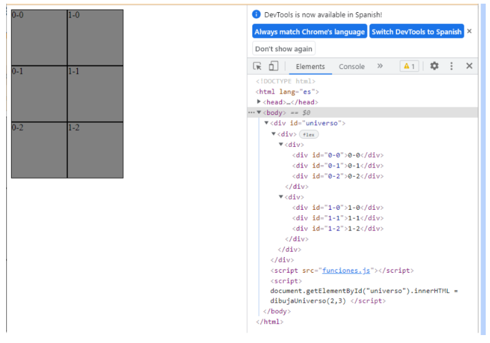
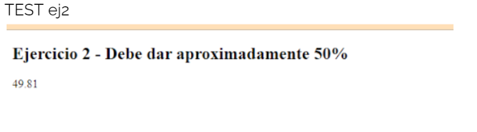
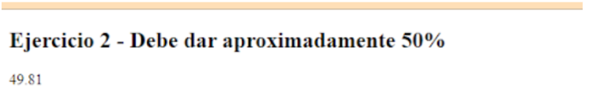
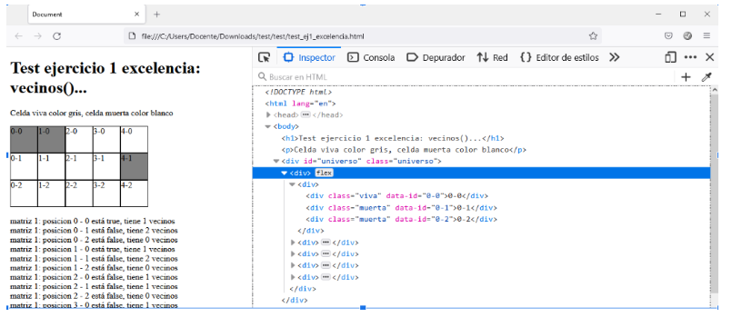
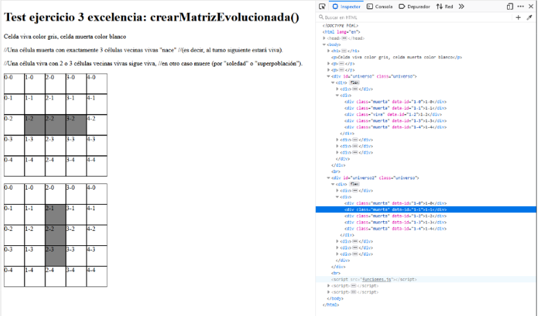

# Práctica 9 - El Juego de la Vida

En esta práctica, desarrollarás una implementación completa del **Juego de la Vida** de Conway utilizando JavaScript y HTML. Al finalizar, tendrás un juego funcional donde podrás observar cómo evoluciona un universo de células según las reglas del juego.

**Recursos:**

- [Juego de la Vida en Wikipedia](https://es.wikipedia.org/wiki/Juego_de_la_vida)
- [Video explicativo](https://www.youtube.com/watch?v=omMcrvVGTMs&feature=emb_logo)

**Instrucciones Generales:**

- Crea una carpeta para esta práctica y dentro de ella, un archivo `funciones.js` donde colocarás todas las funciones que se solicitan en los ejercicios.
- Utiliza buenas prácticas de programación: comentarios, nombres de variables descriptivos y estructura clara del código.
- Al finalizar cada tarea, verifica su funcionamiento utilizando los tests proporcionados o creando tus propias pruebas.

---

## Tarea 1: `dibujaUniverso()`

Crea una función `dibujaUniverso(columnas, filas)` que reciba como parámetros el número de columnas y filas, y genere un grid de elementos `<div>` que represente el universo del juego.

Por ejemplo, al llamar `dibujaUniverso(2, 3)`, la función debe generar el siguiente código HTML:

```html
<div class="universo">
  <div class="fila">
    <div class="celula" data-id="0-0">0-0</div>
    <div class="celula" data-id="0-1">0-1</div>
    <div class="celula" data-id="0-2">0-2</div>
  </div>
  <div class="fila">
    <div class="celula" data-id="1-0">1-0</div>
    <div class="celula" data-id="1-1">1-1</div>
    <div class="celula" data-id="1-2">1-2</div>
  </div>
</div>
```

**Notas:**

- Utiliza `data-id` en lugar de `id` para evitar posibles conflictos.
- Cada celda debe tener clases apropiadas para poder aplicar estilos CSS posteriormente.

**Test:**

Verifica que al llamar a la función se genera el HTML correcto y que se visualiza adecuadamente en el navegador.

---

## Tarea 2: `aleatorio()`

Crea una función `aleatorio()` que retorne un valor booleano: `true` el 50% de las veces y `false` el otro 50%.

**Test:**

Realiza múltiples llamadas a la función y verifica que aproximadamente la mitad de las veces retorna `true` y la otra mitad `false`.

---

## Tarea 3: `aleatorioPorcentaje()`

Crea una función `aleatorioPorcentaje(porcentaje)` que reciba un número entre 0 y 100 y retorne `true` con una probabilidad igual al porcentaje dado.

**Test:**

- Crea un test que llame a `aleatorioPorcentaje(30)` 10,000 veces y cuente el número de veces que retorna `true`. El resultado debería estar cercano al 30% (es decir, alrededor de 3,000 veces).

---

## Tarea 4: `crearMatriz()`

Crea una función `crearMatriz(columnas, filas)` que retorne un array bidimensional (matriz) de las dimensiones dadas. Llena la matriz con valores `true` o `false` utilizando la función `aleatorio()` para determinar si cada célula está viva (`true`) o muerta (`false`).

**Test:**

- Verifica que la matriz generada tiene las dimensiones correctas.
- Opcional: Muestra la matriz en la consola para verificar los valores.

---

## Tarea 5: `dibujaUniversoConEstado()`

Actualiza la función `dibujaUniverso(columnas, filas)` o crea una nueva función `dibujaUniversoConEstado(matriz)` que reciba una matriz como parámetro y genere el grid HTML, asignando a cada célula la clase `"viva"` o `"muerta"` según el estado (`true` o `false`) en la matriz.

**Notas:**

- Utiliza `data-id` para identificar cada célula.
- Las clases `"viva"` y `"muerta"` permitirán aplicar estilos CSS diferentes.

**Test:**

- Aplica estilos CSS para las clases `"viva"` y `"muerta"` (por ejemplo, colores diferentes) y verifica que el universo se visualiza correctamente según el estado de la matriz.

---

## Tarea 6: `contarVecinosVivos()`

Crea una función `contarVecinosVivos(matriz, x, y)` que reciba la matriz y las coordenadas de una célula, y retorne el número de vecinos vivos que tiene.

**Notas:**

- Considera que el universo es finito y las células en los bordes tienen menos vecinos.
- Los vecinos son las células adyacentes en las ocho direcciones (horizontal, vertical y diagonal).

**Test:**

- Crea matrices de prueba y verifica que la función retorna el número correcto de vecinos vivos para diferentes células.

---

## Tarea 7: `evolucionarCelula()`

Crea una función `evolucionarCelula(matriz, x, y)` que reciba la matriz y las coordenadas de una célula, y retorne el nuevo estado (`true` o `false`) de la célula según las reglas del Juego de la Vida:

1. Una célula viva con menos de dos vecinos vivos muere (soledad).
2. Una célula viva con dos o tres vecinos vivos sigue viva.
3. Una célula viva con más de tres vecinos vivos muere (sobrepoblación).
4. Una célula muerta con exactamente tres vecinos vivos vuelve a la vida (reproducción).

**Test:**

- Verifica el funcionamiento de la función con diferentes escenarios y estados iniciales.

---

## Tarea 8: `crearMatrizEvolucionada()`

Crea una función `crearMatrizEvolucionada(matrizActual)` que reciba una matriz representando el estado actual del universo y retorne una nueva matriz representando el siguiente estado, aplicando las reglas del Juego de la Vida a cada célula.

**Test:**

- Utiliza matrices de prueba y verifica que la matriz evolucionada es correcta.
- Compara estados consecutivos para observar la evolución.

---

## Tarea 9: `copiarMatriz()`

Crea una función `copiarMatriz(matrizOrigen, matrizDestino)` que copie el contenido de `matrizOrigen` en `matrizDestino`.

**Notas:**

- Asegúrate de copiar los valores y no las referencias, para evitar modificar la matriz original al cambiar la copia.

**Test:**

- Verifica que después de copiar, ambas matrices tienen los mismos valores pero son objetos diferentes.

---

## Tarea 10: Implementación Completa del Juego

Ahora, utilizando todas las funciones anteriores, implementa la lógica completa del Juego de la Vida.

**Pasos:**

1. **Inicialización:**
   - Genera una matriz inicial aleatoria utilizando `crearMatriz()`.
   - Dibuja el universo inicial en el DOM utilizando `dibujaUniversoConEstado()`.

2. **Evolución:**
   - En cada iteración, calcula la matriz evolucionada utilizando `crearMatrizEvolucionada()`.
   - Actualiza la visualización en el DOM para reflejar el nuevo estado.

3. **Animación:**
   - Utiliza `setInterval()` o `requestAnimationFrame()` para avanzar el juego automáticamente cada cierto tiempo (por ejemplo, cada 500 ms).

4. **Interacción del Usuario (Opcional):**
   - Permite al usuario pausar y reiniciar el juego.
   - Permite al usuario modificar el estado inicial haciendo clic en las células para cambiar su estado.

**Test:**

- Ejecuta el juego y observa cómo evoluciona el universo.
- Verifica que se cumplen las reglas del Juego de la Vida en cada iteración.
- Observa patrones conocidos como osciladores, naves espaciales, etc.

---

## Recursos Adicionales (Opcional)


- **Patrones Predefinidos:** Añade la opción de cargar patrones iniciales famosos (Glider, Small Exploder, etc.).
- **Ajuste de Velocidad:** Permite al usuario ajustar la velocidad de la simulación.
- **Diseño y Estética:** Mejora la interfaz del juego con estilos CSS avanzados y efectos visuales.

---

**Entrega:**

- Asegúrate de que todo el código está bien organizado y comentado.
- Incluye un archivo `index.html` que cargue tus scripts y permita ejecutar el juego en un navegador.
- Comprueba que no hay errores en la consola del navegador.

---

**¡Felicidades!** Si has completado todas las tareas, habrás creado tu propia versión del Juego de la Vida. Este proyecto te ayudará a practicar conceptos importantes como manipulación del DOM, arrays bidimensionales, funciones y lógica condicional.

---

# Anexos y Consejos

- **Depuración:** Utiliza `console.log()` para imprimir información útil durante el desarrollo y depuración de tus funciones.
- **Estructura del Código:** Organiza tu código en módulos o secciones lógicas para facilitar su lectura y mantenimiento.
- **Comentarios:** Añade comentarios descriptivos en tus funciones para explicar su propósito y funcionamiento.

---

**Ejemplo de Estilos CSS Básicos:**

```css
.universo {
  display: flex;
  flex-direction: column;
}

.fila {
  display: flex;
}

.celula {
  width: 20px;
  height: 20px;
  border: 1px solid #ccc;
}

.viva {
  background-color: #000;
}

.muerta {
  background-color: #fff;
}
```

**Nota:** Ajusta los estilos según tus preferencias para mejorar la apariencia del juego.

---


**TEST**




**TEST ej2**


**TEST ej3**

Per fer aquest test: Crea una funció que cridi a aleatorio2(30) de manera ciclica (10000 vegades) y retorni el número de vegades que dona `true` (en percentatge), que hauria de ser proper a 30.00



**TEST ej4**

Prenent F5 veuràs com canvien les caselles vives o mortes

**TEST **



**TEST**


**TEST**



**TEST** 

https://www.youtube.com/watch?v=mKRVy9II02Y

**Versión evolucionada:**

https://drive.google.com/drive/search?q=el%20joc%20de%20la%20vida


